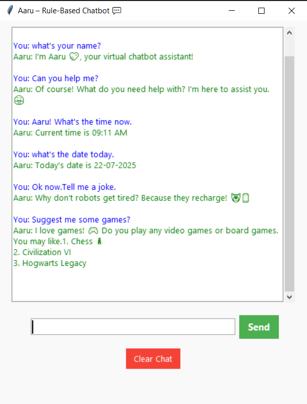

# 💬 Aaru – Rule-Based Chatbot (Tkinter GUI)

**Aaru** is a friendly desktop chatbot built using **Python's Tkinter GUI**. It provides fun, conversational responses based on rule-based logic. This assistant can respond to greetings, time/date queries, jokes, motivational quotes, and more — all from a beautifully designed GUI interface.

---

## 🌟 Features

- 🧠 Rule-based chatbot logic (if-else)
- 💬 Interactive conversation experience
- 🎨 GUI made using **Tkinter**
- 📅 Tells current date and time
- 😄 Motivates you when you're feeling low
- 🤓 Suggests books, games, and fun facts

---

## 🖥️ Tech Stack

| Language | Library        | Purpose            |
|----------|----------------|--------------------|
| Python   | `tkinter`      | GUI Design         |
| Python   | `datetime`     | Time/Date Fetching |
| Python   | `scrolledtext` | Chat Window Scroll |

---

## 📸 Screenshot

FINAL OUTPUT:

---


## 📁 Project Structure
Aaru_AI/
├── aaru_chatbot.py # Main Python file
├── README.md # Project documentation


## 🚀 How to Run

### 1. Clone the Repository (or download ZIP)

```bash
git clone https://github.com/guptaKartikey/CODSOFT.git
cd CODSOFT/Aaru_AI

#Recommended: Python 3.8+

# Run the Chatbot
---cmd
 python Aaru_gui.py

# 🔒 License

This project is created as part of **CodSoft Internship Projects**  
 Kartikey Gupta - JUNE BATCH B36