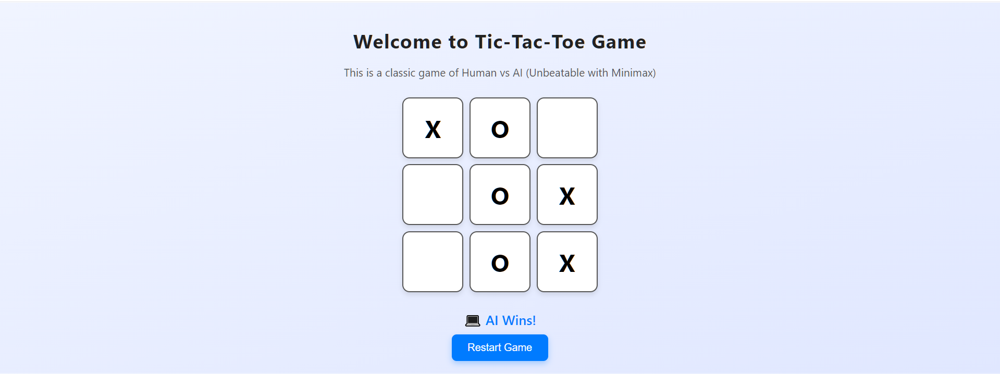

# 🎮 Tic-Tac-Toe AI – Human vs Unbeatable Computer

This is a web-based **Tic-Tac-Toe game** built using **HTML, CSS, and JavaScript**, where you play against an **unbeatable AI** powered by the **Minimax algorithm**. The AI always plays optimally and never loses!

---

## ✨ Features

- ✅ Classic Tic-Tac-Toe gameplay
- 🤖 AI uses Minimax for perfect decision-making
- 😄 Clean and responsive UI
- 🔄 Restart game button

---

## 🧠 How the AI Works

The AI uses the **Minimax algorithm**, a decision-making algorithm used in two-player games. It evaluates all possible future moves and chooses the one that minimizes the possible loss (for a win or a draw).

---

## 📸 Screenshot: Gameplay view

## 📁 Folder Structure
TicTacToe_AI/
├── index.html # Main game logic and UI
├── index.css # Styling for the board and layout
├── README.md # Project documentation

## 🚀 How to Run
 Right-click on `index.html` and select **"Open with Live Server"**

 ## 🎯 Gameplay Instructions

- You play as `X` and the computer plays as `O`.
- Click on any empty cell to make your move.
- The AI will respond instantly using the best possible move.
- Click **"Restart Game"** to play again.

---

## 📚 Tech Stack

- **HTML5**
- **CSS3**
- **Vanilla JavaScript**
- Minimax algorithm for AI

---

## 🔒 License

This project is created as part of **CodSoft Internship Projects**  
 Kartikey Gupta - JUNE BATCH B36

---

> Built with passion for fun and logic 💡🎉