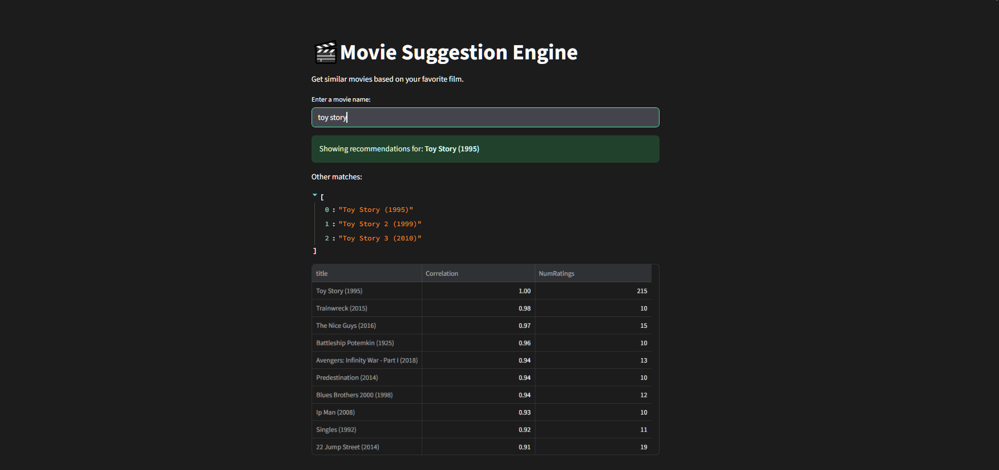

# 🎬 Movie Recommendation System

This is a **content-based movie recommender app** built with **Python, Pandas, Streamlit**, and **Scikit-learn**. It allows users to enter any movie name and get recommendations for similar movies based on correlation and user ratings.

## 🔍 Features

- Search for any movie by title (partial matching supported)
- Get top 10 most similar movies based on user ratings
- Filters out low-rated and niche titles (minimum ratings threshold)
- Simple and clean Streamlit UI
- Fast recommendations via pre-loaded matrix correlation

---

## 🚀 Screenshot


---

## 🛠️ Project Structure
mov_ai/
│
├── .streamlit/
│ └── config.toml # Streamlit theme (dark mode config)
│
├── data/
│ ├── movies.csv # Movie metadata
│ └── ratings.csv # User ratings data
│
├── src/
│ ├── pycache/ # Python bytecode cache
│ ├── recommender.py # Core recommendation logic
│── main.py # CLI runner
│── streamlit_app.py # Streamlit UI logic
│── requirements.txt # Python dependencies
|── README.md # Project documentation

## Tech Stack Used
| Layer                | Tools / Libraries                                                   |
| -------------------- | ------------------------------------------------------------------- |
| Programming Language | Python                                                              |
| Data Handling        | Pandas                                                              |
| Machine Learning     | Scikit-learn (for similarity calculation)                           |
| Web App Interface    | Streamlit                                                           |
| Data Source          | [MovieLens 100k Dataset] |

## 📦 Installation

1. **Clone the repository**
   ```bash
   git clone https://github.com/your-username/movie-recommender.git
   cd mov_ai

## Install dependencies
---cmd
pip install -r requirements.txt

## Run the App
---cmd
streamlit run streamlit_app.py


# 🔒 License

This project is created as part of **CodSoft Internship Projects**  
 Kartikey Gupta - JUNE BATCH B36